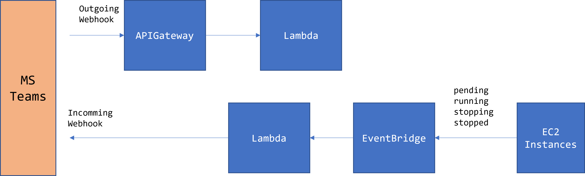

# Backend Development with CDK + TypeScript + Express

## Dev Stack

* TypeScript
* express
* [serverless-express](https://github.com/vendia/serverless-express)
* aws-cdk (2.0.0-rc)


## Hotswap developemnt

AWS CDKにLambda関数を数秒でデプロイするhotswap deployments機能を使ったデプロイ

```
cdk deploy --hotswap
```

## Overview

// TODO 構成イメージ（Teams連携は作りかけ）

